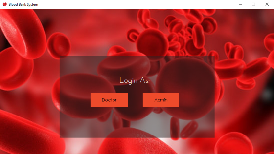
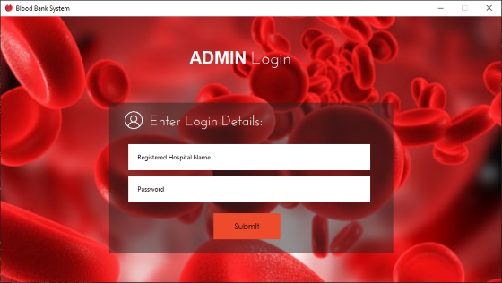
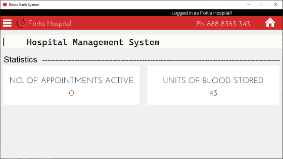
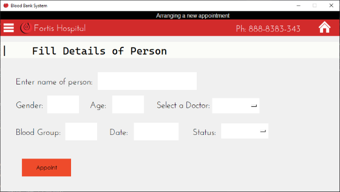
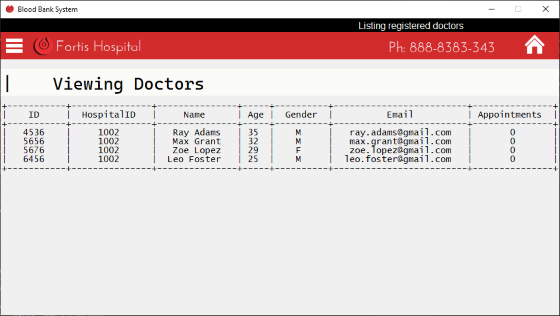
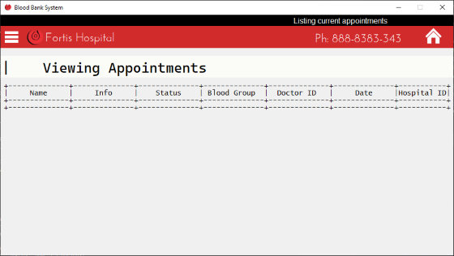
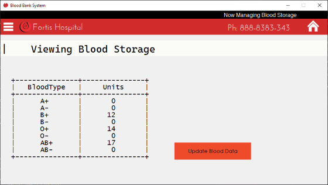
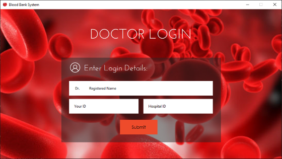
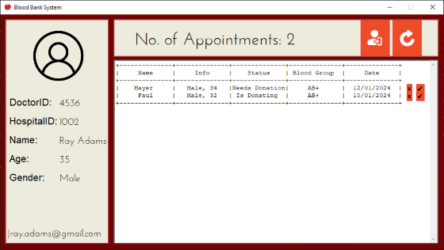

# A tkinter project
Tkinter project for a Blood Bank Management System, backed with functioning database system and features
###### NOTE:    THIS IS NOT A PUBLIC PACKAGE

# Dependencies 
- Tkinter @ Python `3.11`
- MySQL w/Python, `v8.0.33`
- pickle/datetime; packed along with python
- OS dependant modules

Built to work on windows, should work on linux.

## Running this
Install Python **3.7 or newer**, along with MySQL and `mysql-connector-python`
MYSQL connectivity achieved in `database.py`

Clone the project
```bash
git clone https://github.com/UnKnownnPasta/bloodbank-proj-SQL.git
```

# Functionality
Access for Doctors to handle appointments; approving/disposing them
Access for highler level hospital stagg ("Admin") for creating appointments, managing doctors and blood storage

* Admin:
    - Arrange appointments with doctors
    - Access stored units of blood, add/remove units of blood
    - View active appointments
    - View registered doctors
* Doctor:
    - View all arranged appointments
    - Deny/Approve appointments
    - Update blood storage

# 🖼 Gallery

## App launched

## Admin login view

## Admin home page

## Arrange appointment

## View registered doctors

## View appointments

## View blood storage

## Doctor login view

## Doctor home page
